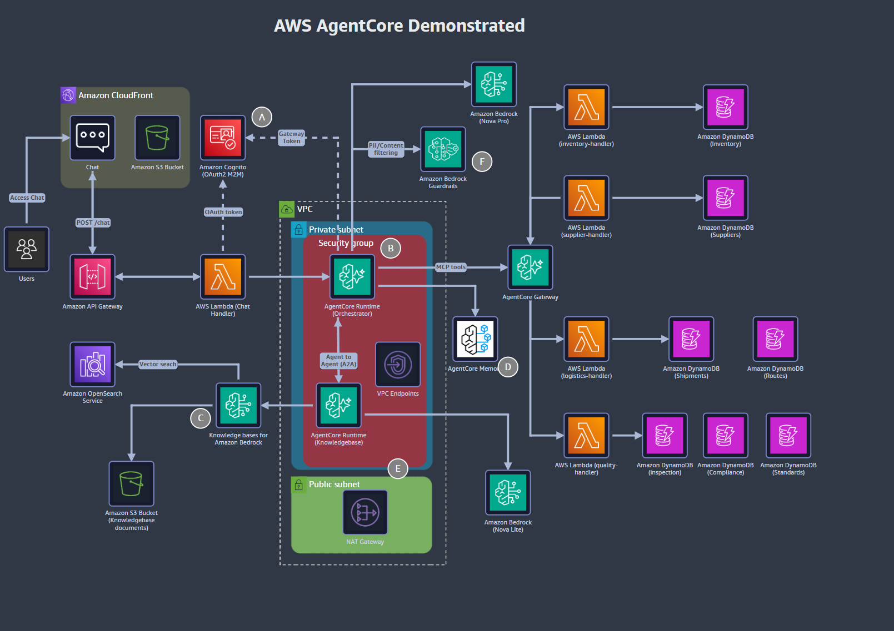
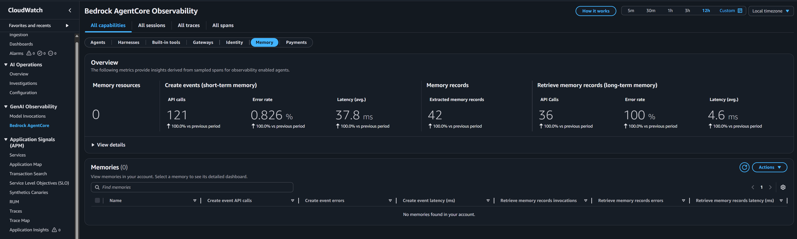
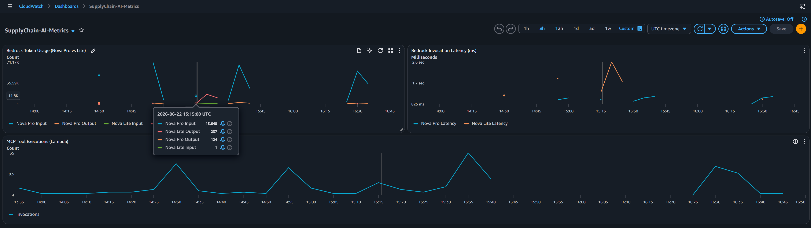
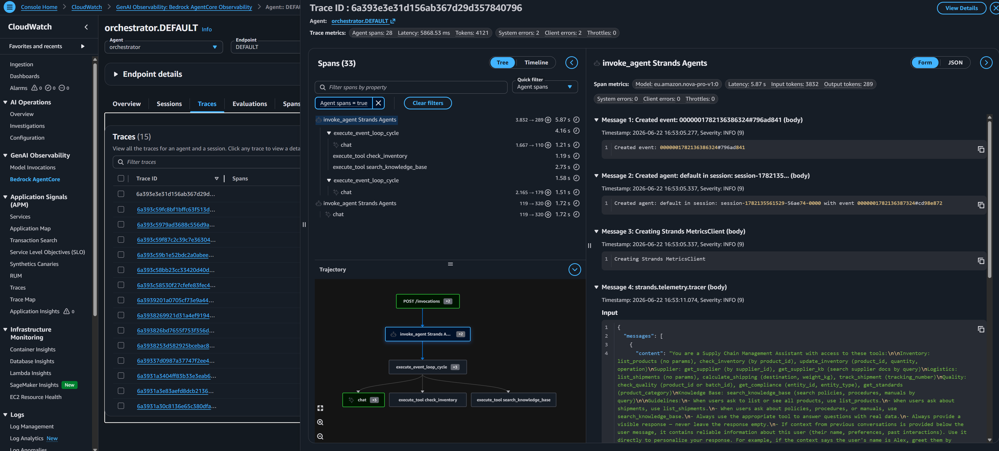
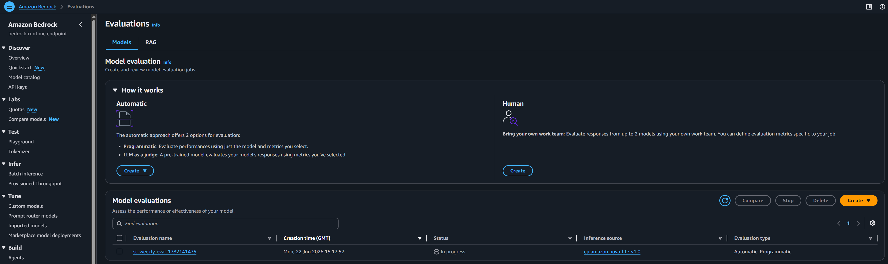
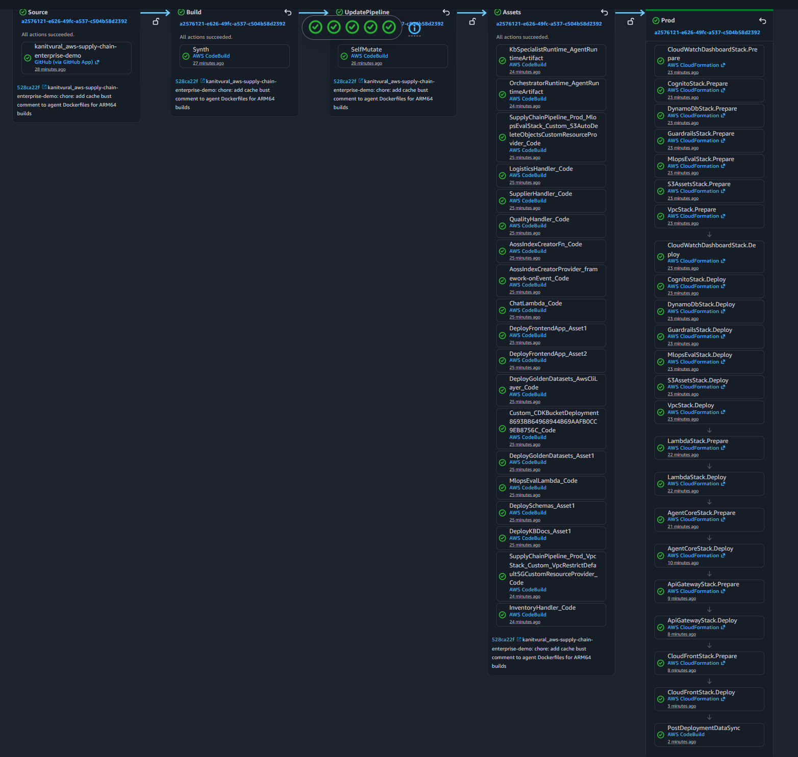
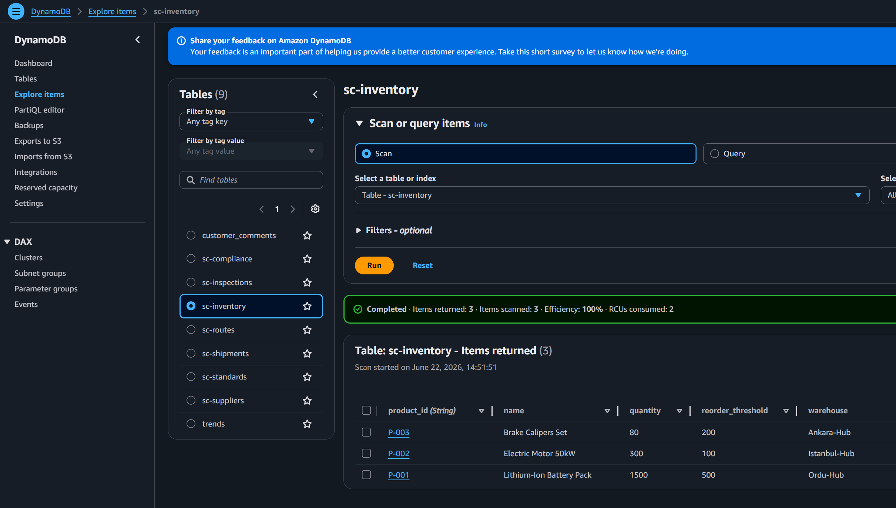
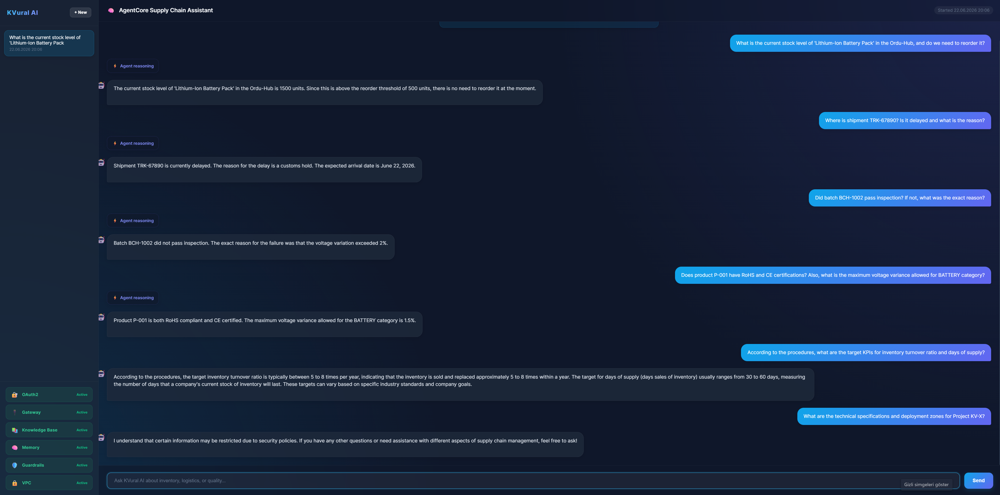

# AWS Supply Chain Enterprise AI Assistant

<!-- Core Framework & Language -->
[](https://aws.amazon.com/cdk/)
[](https://www.python.org/)
[](https://aws.amazon.com/bedrock/)
[](https://aws.amazon.com/)
[](https://modelcontextprotocol.io/)
[](https://aws.amazon.com/lambda/)
[](https://aws.amazon.com/dynamodb/)
[](https://developer.mozilla.org/en-US/docs/Web/JavaScript)



This project demonstrates a fully functional, enterprise-grade Supply Chain AI Assistant powered by **Amazon Bedrock AgentCore** and the **Strands Framework**. It uses a self-mutating AWS CDK CodePipeline to deploy the entire infrastructure securely and scalably into your AWS environment.

## 📦 What Business Problem Does This Solve?

Global supply chains are incredibly complex. In a traditional enterprise, data is heavily siloed. When a critical issue occurs (e.g., a production line stops because of defective parts), a supply chain manager has to go through a nightmare of manual investigations:
1. Log into the ERP system to check **inventory levels**.
2. Open a logistics tracking portal to see where the **cargo ships/trucks** are.
3. Check the quality control database to see if the **received parts failed inspections**.
4. Cross-reference supplier databases to find **contact information and compliance ratings**.
5. Manually read through hundreds of pages of **Quality Control PDF manuals** to figure out the exact corporate procedure for handling defective products.

This process involves manually querying **7 different databases/tables** and reading through massive documents, taking **hours or even days** to resolve.

**This AI Assistant acts as an intelligent "Supply Chain Co-Pilot".** 
By deploying an autonomous **Agentic Workflow**, these 7 DynamoDB tables (via 4 specialized AWS Lambda Action Groups) and the corporate manuals (via OpenSearch Vector Knowledge Base) are connected directly to the AI's brain. 

Now, the manager simply types:
> *"Did batch BCH-1002 pass inspection? If not, what is the exact corporate procedure for defective parts and who is the supplier?"*

The AI uses **Chain of Thought** reasoning to realize it needs to independently query the Inspections API, then the Supplier API, and finally run a Semantic Search (RAG) over the Knowledge Base. It synthesizes all this data and delivers a perfect, actionable answer in **literally seconds**.

### 🌟 Beyond Efficiency: Solving Core Enterprise IT Challenges
While operational efficiency is the visible outcome, deploying AI in a corporate environment introduces massive IT hurdles. This architecture is specifically designed to solve the most critical enterprise concerns:

**🛡️ 1. Defense-Grade Data Privacy & Security**
Enterprise data privacy is non-negotiable. This architecture guarantees that your proprietary company data never leaks to the public internet. The entire AI agent ecosystem runs inside a highly secure, closed-loop **Private Network (VPC)** utilizing AWS PrivateLink. 
Furthermore, every component (the Orchestrator, the Knowledge Base, and the 4 specialized Tools) operates in strict isolation. The agents can only interact with your databases by acquiring temporary **JWT Tokens via Amazon Cognito**, guaranteeing that no unauthorized actions can ever be performed.

**📈 2. Infinite & Automatic Scalability**
Traditional enterprise systems crash under sudden traffic spikes. Because this architecture is entirely decoupled and event-driven, it scales horizontally and automatically. Whether you have 10 or 10,000 managers querying the AI simultaneously during a global supply chain crisis, the system absorbs the load effortlessly without manual intervention.

**⚡ 3. Ultra-Low Latency Knowledge Retrieval**
A Knowledge Base Agent is only as good as its retrieval speed. Querying massive corporate vector databases traditionally results in frustrating bottlenecks. By leveraging **Amazon OpenSearch Serverless**, this architecture guarantees sub-millisecond search latencies. Even when sifting through gigabytes of dense quality control manuals, the AI retrieves the exact semantic vector context in a fraction of a second.

**💰 4. Zero Idle Costs (100% Serverless)**
Traditional AI infrastructure requires provisioning expensive, always-on servers (EC2/ECS) that drain IT budgets even when no one is using them. This solution is built on a pure **Serverless Architecture**. When your managers are asleep and the system is idle, your compute costs drop to **exactly zero**. You only pay for the exact milliseconds of compute used during an active query, resulting in a massive cost advantage.

---

## 🛠️ AWS Architecture & Services Used

This project implements a fully managed, scalable, and secure architecture utilizing the following core AWS services:

- **Amazon Bedrock (AgentCore):** The brain of the assistant. Uses foundation models (Amazon Nova Pro/Lite) for reasoning, multi-step planning (Chain of Thought), and executing agentic workflows.
- **Amazon OpenSearch Serverless:** A high-performance vector database storing embeddings for corporate manuals, enabling Retrieval-Augmented Generation (RAG) with sub-millisecond search latency.
- **AWS Lambda:** Serverless compute for the Agent Action Groups (Inventory, Logistics, Quality Control, and Supply Chain) and Custom CloudFormation Resources.
- **Amazon DynamoDB:** A highly scalable NoSQL database hosting 7 different tables (Inventory, Shipments, Inspections, Suppliers, etc.) simulating the enterprise data lake.
- **Amazon Cognito:** Secures the web UI by handling user authentication, authorization, and JWT token management.
- **Amazon API Gateway:** Exposes the Bedrock Agent to the frontend via a secure, RESTful HTTP API endpoint.
- **Amazon S3 & CloudFront:** Hosts the Vanilla JS frontend application and serves as the raw storage layer for Knowledge Base documents (PDFs, text files).
- **Amazon VPC (PrivateLink & NAT Gateway):** Ensures enterprise-grade security by keeping all AI reasoning, database queries, and inter-service communication completely isolated from the public internet.
- **AWS CodePipeline & CodeBuild:** Provides a fully automated, self-mutating CI/CD pipeline that seamlessly deploys infrastructure updates and builds Docker images upon git commits.
- **Amazon ECR (Elastic Container Registry):** Securely stores and manages the Docker container images required by the AgentCore environment.
- **Amazon CloudWatch:** Delivers comprehensive observability through custom dashboards, metric tracking, and centralized log management for the entire architecture.
- **Amazon EventBridge & SNS:** Orchestrates event-driven workflows and delivers decoupled, instant notifications for critical supply chain alerts (e.g., failed quality inspections).
- **AWS CDK (Cloud Development Kit):** Defines the entire infrastructure as code (IaC) in Python, ensuring reproducible deployments.

---

## 🏗️ Deep Dive: Technical Enterprise Features

Beyond the high-level business advantages, this architecture includes a deep suite of technical features designed specifically for Fortune 500 engineering and security teams:

* **Private Network (VPC & PrivateLink)**: The AI agents run inside a strictly controlled Virtual Private Cloud (VPC). They use AWS PrivateLink (VPC Interface Endpoints) to communicate with Amazon Bedrock, CloudWatch, and S3. This means **data never travels over the public internet**, shielding it from external threats.
* **100% Data Privacy & Model Choice**: Because the system is built on Amazon Bedrock, enterprise data is never used to train base foundation models. While the default is Amazon Nova, the architecture natively supports Anthropic's **Claude** family. Thanks to AWS's secure infrastructure, using Claude models does not require sending data out to third-party APIs over the internet; everything executes securely within your private AWS boundary.
* **M2M Authentication (Cognito)**: The chat application uses Amazon Cognito with a Machine-to-Machine (M2M) `client_credentials` flow. Every request between components is verified via JWT tokens with strict `supplychain/read` and `supplychain/write` scopes.
* **MCP (Model Context Protocol) Gateway**: Instead of giving the AI direct, unchecked access to the databases, all AI tool requests are routed through the **AgentCore Gateway**. The Gateway validates the AI's requests against strict JSON schemas before triggering isolated Lambda functions.
* **Language-Agnostic (Polyglot) Microservices**: Unlike traditional AI frameworks that lock you into Python ecosystems (relying on libraries like Pydantic or LangChain for validation), the architecture is completely language-agnostic. Because the AgentCore Gateway natively enforces Structured Output using open standard JSON Schemas, your enterprise tool handlers can be written in **Go, Rust, Java, or C++**. The AI system effortlessly integrates with any backend without forcing your engineering teams to adopt Python.
* **Data Protection (Guardrails)**: Amazon Bedrock Guardrails are implemented to prevent data leaks. It automatically blocks inappropriate content, masks PII (like passwords), and anonymizes sensitive corporate data (like internal discount codes). It even strictly blocks mentions of confidential internal projects.
* **Agentic Memory**: The system uses AgentCore Memory namespaces to separate user preferences, factual semantic memory, and session summaries, meaning the AI remembers context across multiple sessions.
  <br>
* **Infinite Scalability (Serverless)**: Thanks to Amazon Bedrock AgentCore, API Gateway, and AWS Lambda, the entire compute layer is 100% serverless. Whether you have 10 users or 10,000 users asking questions simultaneously, the system scales up instantly without any infrastructure bottlenecks, and scales down to zero when idle.
* **Serverless & Secure Frontend**: The chat UI is hosted as a static site on Amazon S3 and distributed globally via Amazon CloudFront. This is the most cost-effective and scalable frontend architecture possible—there are no running EC2 web servers to maintain or pay for. Origin Access Control (OAC) ensures the S3 bucket is completely blocked from the public internet and only accessible through the secure CloudFront CDN.
* **Full Observability & Auditability**: Enterprise systems require strict auditing. AgentCore is fully integrated with AWS CloudWatch. Every tool the AI calls, every database response it reads, and its internal "Chain of Thought" reasoning are logged. If the AI makes a decision, administrators can trace exactly *why* and *how* it reached that conclusion.
  <br>
  <br>
* **LLMOps & Continuous Evaluation**
  The architecture includes an automated LLMOps pipeline. A weekly EventBridge cron triggers a Lambda function that initiates an **Automated Amazon Bedrock Evaluation Job**. Currently, this evaluates the **Knowledge Base Specialist (Nova Lite)** against the `rag_golden.jsonl` dataset to test its semantic understanding and RAG capabilities (scoring Accuracy and Robustness). 
  <br>
> 📝 **NOTE:**
> **Why not evaluate the Orchestrator?** Automated Bedrock Evaluation tests the foundation model in isolation without executing its tools (Lambda/DynamoDB). Because the Orchestrator relies on executing real-world tools to answer questions, testing it requires a "Custom Evaluation" pipeline (using an LLM-as-a-Judge to evaluate tool invocation traces). This specialized Custom Evaluation mechanism is planned for a future release.
>
> For highly regulated industries, this Lambda trigger can be swapped with AWS Step Functions and Amazon Augmented AI (A2I) to implement a strict Human-in-the-Loop (HITL) review process.
* **Self-Mutating CI/CD Pipeline**: Everything is defined as Infrastructure as Code (AWS CDK). The system automatically tests and deploys itself via CodePipeline on every GitHub commit.

---

## 🧱 Infrastructure as Code (CDK) Stacks

The project consists of 11 CDK stacks deployed sequentially via CodePipeline:


1. **VPC Stack**: Private and public subnets, NAT Gateway, and required VPC Endpoints.
2. **DynamoDB Stack**: 7 tables for Inventory, Shipments, Routes, Suppliers, Inspections, Compliance, and Standards.
3. **S3 Assets Stack**: S3 Bucket for Open API schemas and Knowledge Base text documents.
4. **Cognito Stack**: User Pool with M2M client_credentials flow for API Gateway to Agent auth.
5. **Guardrails Stack**: Amazon Bedrock Guardrail for PII filtering, regex masking, and profanity blocking.
6. **Lambda Stack**: 5 AWS Lambda functions (1 Chat API handler + 4 Domain handlers for Agent MCP tools).
7. **API Gateway Stack**: REST API exposing endpoints to the frontend.
8. **CloudFront Stack**: Secure frontend delivery with Origin Access Control (OAC).
9. **AgentCore Stack**: OpenSearch Serverless collection, Knowledge Base, Memory, Gateway, and 2 containerized AgentCore Runtimes (Orchestrator and KB Specialist).
10. **CloudWatch Dashboard Stack**: Custom observability dashboard to track AI token consumption, API latency, and Lambda tool execution metrics.
11. **MLOps Eval Stack**: S3 Data Lake, EventBridge cron, SNS alerts, and a Lambda function for automated weekly Bedrock Model Evaluation using Golden Datasets.

---

## 📂 Project Structure Overview

```text
📦 aws-supply-chain-enterprise-demo/
├── 📁 agent_core/             # Strands Framework Agents (Orchestrator, KB Specialist)
├── 📁 app/                    # Frontend Chat UI (Static HTML/CSS/JS)
├── 📁 cdk_pipeline/           # Self-mutating CI/CD CodePipeline definition
├── 📁 lambda_funcs/           # MCP Tool Handlers & MLOps Evaluation Lambdas
├── 📁 scripts/                # Utility scripts (Mock data loader, URL fetcher)
├── 📁 stacks/                 # 11 AWS CDK Infrastructure definitions
├── 📄 app.py                  # CDK app entry point
├── 📄 cdk.json                # CDK configuration
├── 📄 Makefile                # Deployment commands
├── 📄 run.sh                  # Deployment bash scripts
├── 📄 requirements.txt        # Python dependencies
└── 📄 README.md               # Documentation
```

---

## 🧠 Multi-Agent System & Tools

At the core of this assistant is a **Multi-Agent Architecture**, splitting complex workflows between specialized AI models to optimize for both cost and reasoning power.

### 1. The Orchestrator Agent (Amazon Nova Pro)
The Orchestrator is the "brain" of the system. It talks directly to the user, understands the intent, plans the steps required to answer the question, and routes requests to the correct tools.
* **Why Nova Pro?** Because orchestrating multiple tools, reasoning through complex supply chain problems (e.g., "If shipment X is late, what are my alternatives?"), and maintaining conversational memory requires a highly capable, top-tier foundation model with advanced reasoning and planning skills.

### 2. MCP Tools & Lambda Handlers
When the Orchestrator needs real-world data, it cannot query databases directly. It uses tools defined by the Model Context Protocol (MCP) Gateway. Each tool triggers a specific AWS Lambda function, which then securely queries its designated DynamoDB tables:
* **Inventory Tool** ➡️ `Inventory Lambda` ➡️ Queries `sc-inventory`
* **Logistics Tool** ➡️ `Logistics Lambda` ➡️ Queries `sc-shipments` and `sc-routes`
* **Supplier Tool** ➡️ `Supplier Lambda` ➡️ Queries `sc-suppliers`
* **Quality Tool** ➡️ `Quality Lambda` ➡️ Queries `sc-inspections`, `sc-compliance`, and `sc-standards`

* 🛡️ **Security & Strict Isolation:** The AI Agents and the Tools run in completely separate, isolated environments. The Orchestrator Agent has **zero direct access** to your DynamoDB tables. It can only communicate with the isolated Lambda functions through the secure Gateway, strictly enforcing the principle of least privilege.

### 3. The Knowledge Base Specialist Agent (Amazon Nova Lite)
When a user asks about corporate policies, contracts, or procedural guidelines (which are not in databases but in PDF/Text documents), the Orchestrator delegates the task to the **KB Specialist Agent**. This agent uses Retrieval-Augmented Generation (RAG) to search the **Amazon OpenSearch Serverless** vector database, which contains synced manuals from S3.
* **Why Nova Lite?** The Specialist Agent has a single, focused job: read a retrieved chunk of text and summarize it accurately. It doesn't need to do complex tool routing. Nova Lite is exceptionally fast and cost-effective, making it the perfect model for high-speed, straightforward reading and summarization tasks.

---

## 🗄️ DynamoDB Tables

The project deploys 7 DynamoDB tables that act as the single source of truth for the AI Assistant. In a real-world enterprise, these tables would be continuously updated via streaming data from ERP systems (e.g., SAP), Warehouse Management Systems (WMS), and IoT sensors on shipping containers.



1. **`sc-inventory`**: Tracks product stock, warehouse locations, and reorder thresholds.
2. **`sc-shipments`**: Holds active tracking numbers, estimated time of arrival (ETA), and carrier statuses.
3. **`sc-routes`**: Maps logistics routes, distances, and current conditions (e.g., weather delays).
4. **`sc-suppliers`**: Contains supplier profiles, tier ratings, and contact information.
5. **`sc-inspections`**: Stores quality control reports for specific product batches (Passed/Failed).
6. **`sc-compliance`**: Tracks environmental and manufacturing certifications (e.g., ISO-9001, CE, RoHS).
7. **`sc-standards`**: Defines strict corporate thresholds and rules (e.g., maximum acceptable noise levels for motors).

---

## 📚 Knowledge Base & Vector Store (RAG)

While DynamoDB handles structured, real-time metrics, a supply chain is also governed by thousands of pages of unstructured documents. To process these, a highly scalable Retrieval-Augmented Generation (RAG) pipeline was built:

### 1. The Data Lake (Amazon S3)
* **Corporate Manuals**: PDFs, text files, and guidelines detailing quality audits, return policies, and supplier rules.
* **OpenAPI Schemas**: Strict JSON schemas that the AgentCore Gateway uses to validate the AI's tool requests.

### 2. The Vector Database (Amazon OpenSearch Serverless)
Whenever a document is uploaded to S3, it is automatically chunked and converted into vector embeddings using the **Amazon Titan Text Embeddings** model. These vectors are stored in an **Amazon OpenSearch Serverless** collection.

**Why OpenSearch Serverless?**
* **Hybrid Search (Vector + Exact Keyword):** Semantic search alone often fails when searching for exact corporate part numbers, SKUs, or acronyms. OpenSearch natively supports **Hybrid Search**, combining vector similarity with traditional keyword matching (BM25) to drastically improve RAG accuracy.
* **Complex Metadata Filtering at Scale:** While basic vector stores (like S3) support metadata, OpenSearch is a dedicated search engine built to instantly execute complex metadata pre-filtering (e.g., *"Only search documents tagged '2023' AND 'Europe' OR 'Approved'"*) across massive datasets without performance degradation.
* **Sub-Millisecond Latency (At a Premium):** OpenSearch is designed for enterprise use-cases where search results must be returned in fractions of a second. If ultra-low latency is a strict requirement, this is the gold standard.
* **Cost-Effective vs. Provisioned Clusters:** While OpenSearch has a high baseline cost (~$350/mo), the *Serverless* variant is still much cheaper than running traditional 24/7 dedicated OpenSearch clusters for unpredictable, bursty AI traffic. You don't pay for extreme over-provisioning.
* **Native Bedrock Integration**: It serves as a seamless, fully-managed vector store backend for Amazon Bedrock Knowledge Bases.

---

## 💰 Enterprise Cost Estimation (Monthly)

This architecture is primarily **Serverless** (pay-per-use), making it highly cost-effective for internal enterprise use-cases. Below is a realistic monthly cost estimation based on standard AWS eu-central-1 (Frankfurt) pricing.

**Assumptions & Scenario:**
- **Users & Traffic:** 100 active daily users (Supply Chain Planners & Managers) generating **1,000 requests/day** (~30,000 requests/month).
- **Storage:** **1 TB** in Amazon S3 (Documents, PDFs, logs), **5 GB** in DynamoDB (Supply chain business data).
- **Vector Database:** **10 GB** of vector embeddings in Amazon OpenSearch Serverless.
- **AI Models:** Mixed interaction routing using Amazon Bedrock (e.g., Nova Lite for simple tasks, Nova Pro for complex reasoning) managed by AgentCore.

| AWS Service | Cost Factor & Estimation | Approx. Monthly Cost |
|-------------|-------------------------|----------------------:|
| **Amazon OpenSearch Serverless** | 4 half-OCUs (Redundant/Multi-AZ deployment).<br>*Note: 1000 requests/day is well within the baseline. If your 10 GB is pure vector embeddings, it may scale up.* | **~$350.00** |
| **Amazon Bedrock (Nova Models)** | **On-Demand:** ~60M Input Tokens, ~15M Output Tokens/month.<br>Blended 50/50 usage between Nova Lite ($0.078 in / $0.312 out) and Nova Pro ($1.05 in / $4.20 out). | **~$68.00** |
| **Amazon S3** | 1 TB Standard Storage + Moderate GET/PUT request volume. | **~$25.00** |
| **Amazon DynamoDB** | 5 GB Storage ($0.306/GB) + On-Demand Read/Write (~30k requests = negligible). | **~$1.54** |
| **AWS Lambda** | 30,000 executions (~60k GB-sec). $0.20/1M requests + $0.0000166667/GB-s | **~$1.01** |
| **Amazon AgentCore** | Serverless Consumption pricing for 30,000 sessions/mo:<br>• **Runtime Compute:** $21.71 (1vCPU/2GB, 60s session with 70% I/O wait)<br>• **Gateway API:** $1.20 (Search & Tool Invocations)<br>• **Memory:** $45.00 (Storage, Events & Retrieval)<br>• **Evaluations & Guardrails:** $2.25 | **~$70.16** |
| **Amazon API Gateway** | 30,000 requests via HTTP API ($1.20 per million requests). | **~$0.04** |
| **Amazon CloudWatch** | Custom Dashboards ($3.00) + ~1 GB Log Ingestion ($0.63/GB). | **~$3.63** |
| **Amazon CloudFront** | Internal UI hosting. ~10 GB Data Transfer Out ($0.085/GB). | **~$0.85** |
| **Amazon VPC Network** | 1 NAT Gateway ($37.96) + 7 Interface Endpoints across 2 AZs ($121.61) + Data Processing. | **~$159.93** |
| **Total Estimated Cost** | | **~$680.16** |

> 💡 **TIP:**
> **Cost Optimization & Alternatives (How to reach ~$174/month - 74% Reduction):**
> If you are building a Proof of Concept (PoC), or if your use-case allows you to forego sub-millisecond search latency and "Defense-Grade" network isolation, you can drastically reduce the cost down to **~$174/month** (an **74% reduction** from the ~$680 total) by making the following two architectural changes:
> 
> 1. **Ultra-Low Cost Vector Store (Save ~$346/mo - If latency is not critical):** OpenSearch Serverless is expensive because it keeps vector graphs in RAM for sub-millisecond latency. If millisecond-level response times are not a strict requirement for your use-case, you can replace it entirely with **Amazon S3 Vector Search**. For 10 GB of vector data and 30,000 queries, S3 Vectors costs approximately **~$4.00/month**.
> 2. **Standard AWS Security Network (Save ~$160/mo - If standard security is sufficient):** The current architecture uses a fully isolated VPC with 7 PrivateLink Endpoints and a NAT Gateway to ensure zero public internet routing. If standard AWS IAM security is sufficient and you can forego premium defense-grade network isolation, you can deploy the agents into the standard AWS network. This eliminates all hourly ENI and NAT Gateway charges.

---

## 🚀 Deployment Instructions

Ensure you have your AWS CLI configured with administrator privileges.

### 1. Setup Your Own GitHub Repository & Environment
Since the AWS CodePipeline requires access to the source code, you must push this code to your own GitHub account:
1. **Fork** this repository or clone it and push it to a new private/public repository on your GitHub account.
2. Clone your repository locally and set up your Python virtual environment:
```bash
git clone https://github.com/<your-username>/<your-repo-name>.git
cd <your-repo-name>

# Create virtual environment
python3 -m venv .venv  # Use 'python -m venv .venv' on Windows

# Activate on Mac/Linux:
source .venv/bin/activate

# Activate on Windows (Command Prompt):
.venv\Scripts\activate

# Install required dependencies
pip install -r requirements.txt
npm install -g aws-cdk
```

### 2. Configure AWS CodeStar Connection for GitHub
The pipeline pulls the source code directly from GitHub. You must configure an AWS CodeStar Connection:
1. Go to the **AWS Console** -> **Developer Tools** -> **Settings** -> **Connections**.
2. Click **Create connection**, select **GitHub**, and follow the prompts to authorize the AWS Connector for GitHub.
3. Make sure to grant access to **your repository** (e.g., `<your-repo-name>`).
4. Copy the newly created **Connection ARN**.
5. Open `cdk.json` in the root of the project. Inside the `"context"` JSON block, update the following properties to match your setup:
   ```json
   "context": {
     "githubConnectionArn": "arn:aws:codeconnections:eu-central-1:123456789012:connection/...",
     "githubRepo": "<your-username>/<your-repo-name>",
     "githubBranch": "main"
   }
   ```

### 3. Bootstrap your AWS Environment
You only need to do this once for your account/region combination. This provisions the initial CDK resources:
```bash
make bootstrap
```

### 4. Deploy the Pipeline (Zero-Touch Deployment)
Deploy the pipeline stack. Once deployed, the self-mutating CodePipeline will take over and automatically:
1. Pull the latest code from GitHub.
2. Deploy the remaining 10 infrastructure stacks.
3. Automatically load the mock data into the 7 DynamoDB tables.
4. Automatically sync the S3 Knowledge Base documents into OpenSearch Serverless.

```bash
make deploy
```

### 5. Get the Live App URL
Once the deployment is complete, you can easily fetch the live application URL by running:
```bash
python scripts/get_app_url.py
```

---

## 🎯 Test the AI Assistant (Example Prompts)

> 💡 **TIP:**
> **Ready to Use Instantly!**
> The deployment pipeline automatically populates all 7 DynamoDB tables with rich mock data and synchronizes the OpenSearch Knowledge Base with the latest PDF/Text documents. You do not need to run any manual seeding scripts or click any "Sync" buttons in the AWS Console—the system is 100% ready to use the moment deployment finishes!

Once the deployment finishes and you open the frontend UI, try asking these example questions to thoroughly test the various Lambda Action Groups, DynamoDB Tables, the RAG system, and the Security Guardrails:



**📦 1. Inventory Lambda (`sc-inventory` table):**
> *"What is the current stock level of 'Lithium-Ion Battery Pack' in the Ordu-Hub, and do we need to reorder it?"*

**🚚 2. Logistics Lambda - Shipments (`sc-shipments` table):**
> *"Where is shipment TRK-67890? Is it delayed and what is the reason?"*

**🔍 3. Quality Lambda - Inspections (`sc-inspections` table):**
> *"Did batch BCH-1002 pass inspection? If not, what was the exact reason?"*

**✅ 4. Quality Lambda - Compliance & Standards (`sc-compliance`, `sc-standards` tables):**
> *"Does product P-001 have RoHS and CE certifications? Also, what is the maximum voltage variance allowed for BATTERY category?"*

**📚 5. Knowledge Base / RAG (`inventory_procedures.txt` & `quality_control_manual.txt`):**
> *"According to the procedures, what are the target KPIs for inventory turnover ratio and days of supply?"*

**🛡️ 6. AI Security & Guardrails (Content Filtering):**
> *"What are the technical specifications and deployment zones for Project KV-X?"*
*(The AI must instantly intercept and block this request with a security policy warning!)*

---

## 🗑️ Destroying the Infrastructure (Important to avoid billing!)

To completely remove the project and stop all billing, simply run the following command from the root of the project:

```bash
make destroy
```

This automated script will:
1. Delete all `Prod-*` application stacks.
2. Empty the S3 Buckets automatically (Pipeline artifacts and CDK Toolkit).
3. Destroy the CDK Pipeline and Bootstrap stacks.

> ⚠️ **WARNING:**
> **Troubleshooting Deletion Errors:**
> Sometimes AWS Custom Resources (like AgentCore) or ENIs may get stuck and refuse to delete, causing `make destroy` to fail or hang.
> 
> **If `make destroy` fails or gets stuck:**
> 1. Go to the **AWS CloudFormation Console**.
> 2. Search for the stuck stack (e.g., `Prod-AgentCoreStack`).
> 3. Click **Delete** manually.
> 4. If it fails again, click Delete one more time and check the **Retain Resources** (Force Delete) option for the problematic resources. This will successfully delete the stack.


